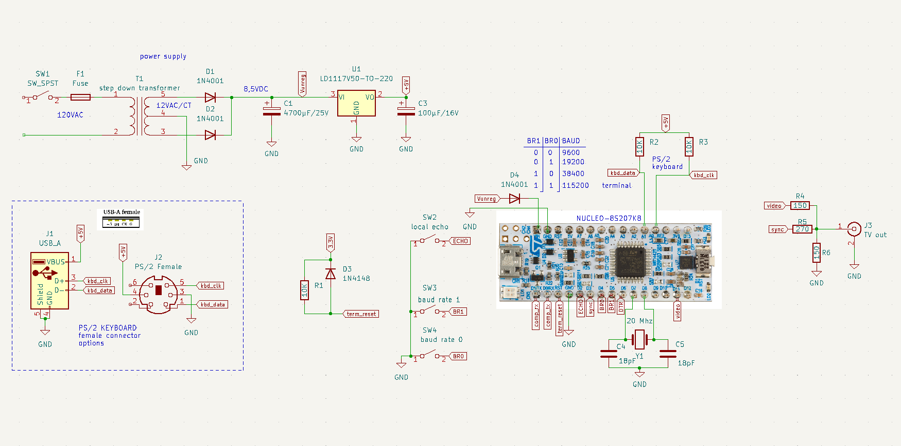

# STM8 terminal 

Un terminal ASCII réalisé sur une carte NUCLEO-S207K8

*   Affichage 40 caractères par ligne, 25 lignes 
*   Clavier PS/2 
*   TVout NTSC. 
*   interface UART niveaux 0:5 volts 

Ce terminal a été créé pour le projet [POMME-I](https://github.com/Picatout/pomme-I).

Les 2 cartes NUCLEO-8S207K8 communique entre elle via le UART. Voir la schématique complète du projet [POMME-I](https://github.com/Picatout/pomme-I) sur le déppôt github de ce dernier. 

## Quand il faut compter les cycles machines.

Sortir 40 caractères par ligne avec un MCU fonctionnant à 20Mhz en utilisant le protocole NTSC n'a pa été évident. Il n'y avait tout simplement pas suffisamment de temps pour utiliser des compteurs avec boucle. Le temps d'affichage d'une ligne de balayage NTSC est de 52µsec. 1 cycle cpu à 20Mhz dure 50nsec on dispose donc d'un maximum de 1040 cycles pour afficher les 40 caractères ce qui donne 26 cycles cpu par caractère.

Après plusieurs expérimentation avec le périphérique SPI qui ne donnait pas de résultat satisfaisant j'ai abandonné le SPI. Pour y parvenir j'ai fait 2 choses. 

1. Le tampon video **video_buffer** ne contient pas les caractères à afficher mais l'adresse du caractère dans la table **font_6x8**. Ainsi il n'y a pas de cycle perdu pour faire le calcul de l'adresse du caractère pendant l'affichage. C'est la routine **tv_putc** qui fait le travail. 

1. Pour sortir les pixels vidéos il faut sérialiser les pixels représentant le caractère. Faire ça en sorftware prend 14 cycles cpu avec la macro  **_shift_out_char** du fichier [tvout.asm](tvout.asm).
La macro **_shift_out_scan_line** prend 20 cycles au total en incluant **_shift_out_char**. Si on fait le calcul pour 40 caractères ça fait 800 cycles soit 40µsec. Bien en déça des 52µsec allouée. Ça c'est selon les cycles machines fournis par le manufacturier du STM8 mais en pratique la durée mesurée à l'oscilloscope est de 51.2µsec. C'est serré! Tellement serré que je ne pouvait utiliser des boucles avec compteurs. Pour arriver à ce temps j'ai du dérouler la macro 40 fois. 

# Où sont passés ces cycles CPU. 

Je me suis mis à réfléchir à cette différence entre le nombre de cycles CPU selon ce que je mesure à l'oscilloscope le temps d'éxécution par caractère serait de 51.2µsec/50nsec=1024/40=25.6 cycles au lieu de 20 cycles. 5.6 de plus. Donc je me demandais où étaient passés ces cycles? Je me suis dit que le fait de lire l'octet dans la table font_6x8 entre en concurrence avec la lecture des instructions machine. STM8 est une architecture Harvard. Ça signigit que le bus d'instruction est séparé du bus de données. Cette architecture a étée conçue pour améliorer la vitesse d'exécution des instructions puisque celle-ci n'ont pas à partager l'accès mémoire avec les données. Je me suis donc dit que si je copiais la table [font_6x8](font.asm) dans la mémoire RAM ce conflit d'accès serait éliminé et que l'exécution serait plus rapide. 

J'ai fait le test et c'est bien le cas, sauf qu'il n'y a qu'un seul cycle machine par caractère de récupéré. L'affichage des 40 caractères avec la police en mémoire RAM prend 49.2µsec soit 2µsec de moins ce qui correspond une fois le calcul fait à 1 cycle par caractère. Il y a donc encore 4.6 cycles manquant. 

Pour comprendre cette différence il faut lire le chapitre 5 du manuel de progammation  [PM0044](https://www.st.com/content/ccc/resource/technical/document/programming_manual/43/24/13/9a/89/df/45/ed/CD00161709.pdf/files/CD00161709.pdf/jcr:content/translations/en.CD00161709.pdf). La section 5.4 et la table 3 nous donnes un bel exemple. Selon le nombre de cycles données dans la description de chaque instruction: 

1.  LDW X,[$50.w] ; 5 cycles 
1.  ADDW X,#20   ; 2 cycles 
1.  LD A,[$300].w ; 4 cycles 

On obtient un total de **11 cycles**. mais dans la table 3 on voit qu'en fait il en faut **12**. 

Donc en conclusion le pipelining permet d'accélérer l'exécution des instructions sauf qu'il n'est plus possible de se fier au nombre de cycles donnés dans la description de chaque instruction pour calculer le temps d'exécution d'une séquence d'instructions, comme c'est le cas pour un mcu PIC 16Fxxxx. 

### 2026-07-5 

* Modification au circuit du terminal pour ajouter des commutateurs pour la sélection d'options utilisateur.

    * **SW3** sert à sélectionner un écho local lorsqu'il est à **1** 
    * **SW4** et **SW5** permettent de sélectionner un BAUD rate pour  le UART.

  SW4|SW5|BAUD 
    -|-|-
    0|0| 9600
    0|1| 19200
    1|0| 38400
    1|1| 115200

Si les commutateurs ne sont pas installés par défaut les broches sont toutes à **1** à travers les résistances *pull up* MCU, donc il y a écho local et le BAUD est à 115200.

Les commautateurs sont lu lors de l'initialisation et toute modification de leur position requiert un redémarrage du MCU pour que la nouvelle configuration prenne effet.

